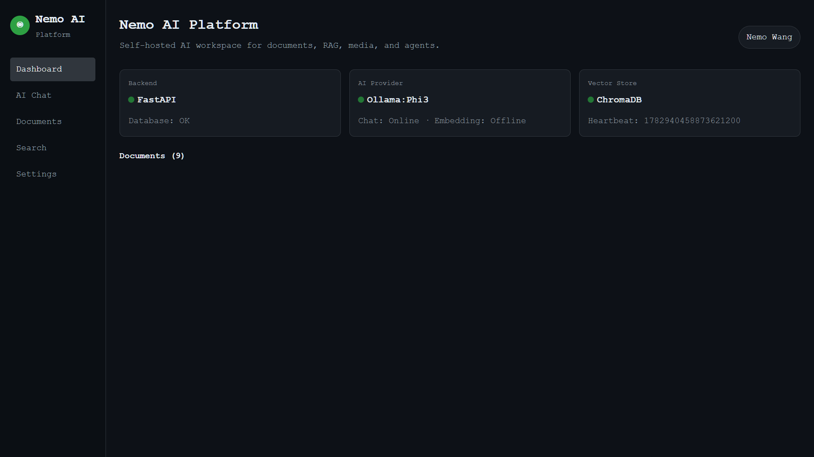
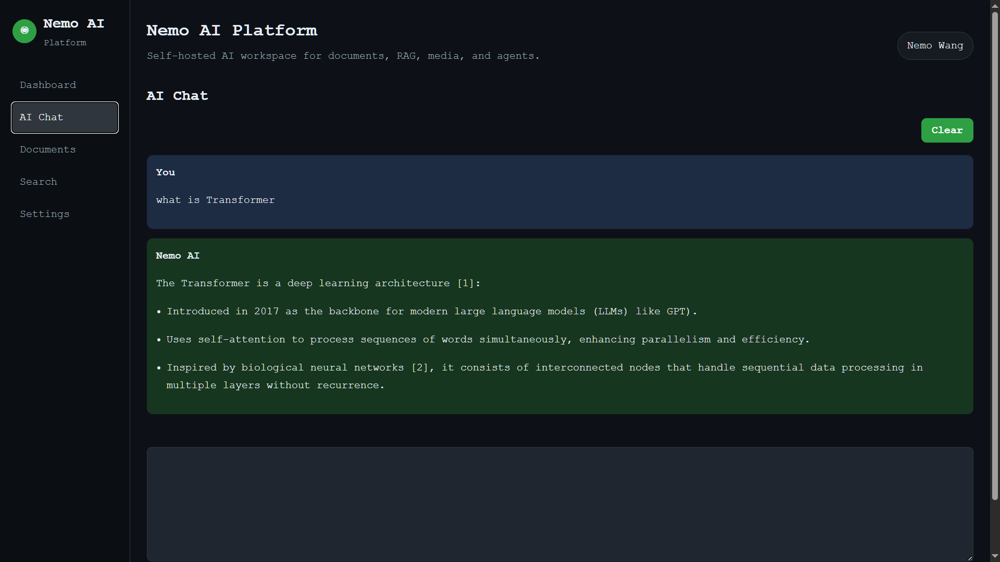
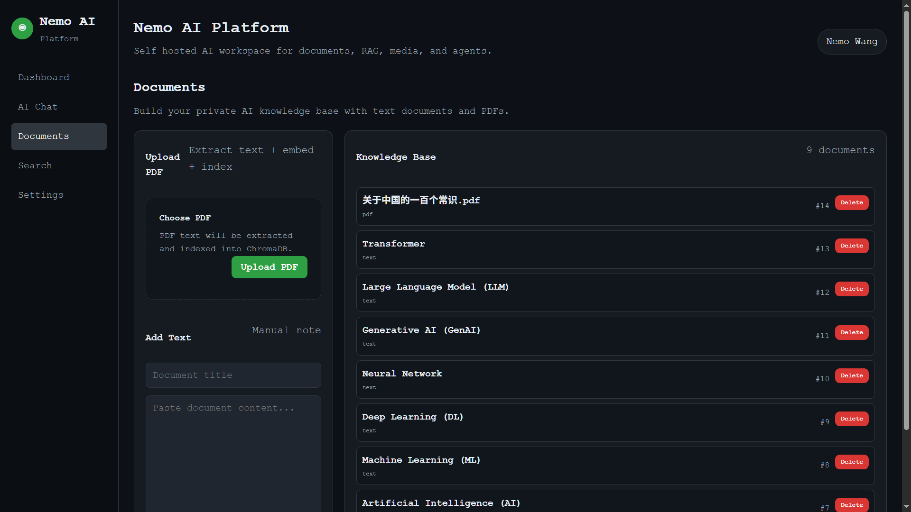
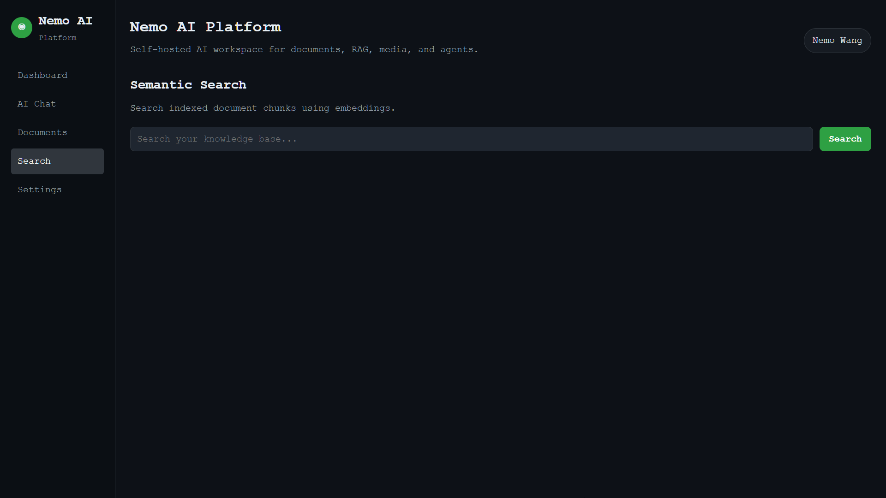

# 🚀 Nemo AI Platform

> Self-hosted AI workspace for documents, RAG, local LLM, and semantic search.

---

## ✨ Features

### 🧠 AI Chat (RAG)
- Multi-turn conversation with context memory
- Retrieval-Augmented Generation (RAG)
- Citation support `[1][2]`
- Markdown rendering
- Local LLM via Ollama (phi3 / llama3 / mistral)

---

### 📄 Documents
- Upload PDF (auto extract + embed + index)
- Add text documents manually
- Delete documents
- Vector storage with ChromaDB

---

### 🔍 Semantic Search
- Search across indexed documents
- Embedding-based retrieval
- Fast similarity search

---

### ⚙️ System Dashboard
- Backend health (FastAPI)
- AI provider status (Ollama / Gemini / OpenAI)
- Vector DB heartbeat (ChromaDB)

---

## 🧱 Architecture

Frontend (React + Vite)
        ↓
FastAPI Backend
        ↓
AI Provider Layer
   ├── Ollama (local LLM)
   ├── Gemini / OpenAI (optional)
        ↓
Vector Store (ChromaDB)
        ↓
PostgreSQL (metadata)

---

## 🖥️ Screenshots

### Dashboard

### AI Chat

### Documents

### Search

---

## ⚙️ Tech Stack

- Frontend: React + TypeScript + Vite
- Backend: FastAPI + Python
- Database: PostgreSQL
- Vector DB: ChromaDB
- LLM: Ollama (phi3 / llama3 / mistral)
- Deployment: Docker + Nginx

---

## 🚀 Quick Start

### Clone

git clone https://github.com/yourname/nemo-ai-platform.git
cd nemo-ai-platform

### Start backend

docker compose up -d --build

### Start frontend

cd frontend
npm install
npm run build

### Deploy frontend

./scripts/deploy_frontend.sh

---

## 🤖 AI Provider

Use Ollama:

ollama run phi3

.env:

DEFAULT_AI_PROVIDER=ollama
OLLAMA_BASE_URL=http://host.docker.internal:11434
OLLAMA_CHAT_MODEL=phi3

---

## 👤 Author

Nemo Wang

GitHub: https://github.com/NemoAng  
LinkedIn: https://www.linkedin.com/in/nemo-wang/

---

## ⭐ Star if useful!
